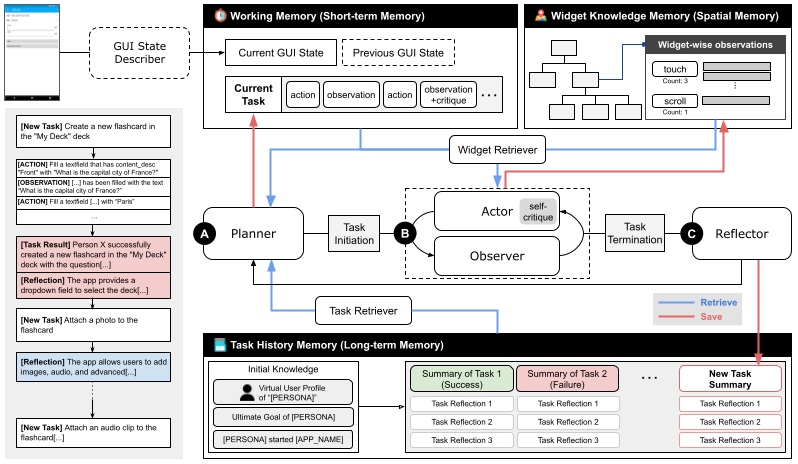

# DroidAgent: Intent-Driven Android GUI Testing with LLM Agents

Test with artificial user intents!

DroidAgent produces **high-level testing scenarios** with executable scripts (currently in the format of [UIAutomator2](https://github.com/openatx/uiautomator2)) by autonomously exploring a given application under test (AUT). It is built as a modular framework driven by multiple LLM instances.



## Table of Contents
1. [Setup](#setup)
2. [Running DroidAgent](#run-droidagent)
3. [Replicate Evaluation Results](#replicate-evaluation-results)
4. [Troubleshooting](#troubleshooting)

## Setup

DroidAgent requires ADB (Android debugging bridge) and several Python libraries installed.

### Prerequisite
* \>=16GB RAM
* \>=Python 3.10
* Android SDK & ADB installed and configured
    1. Install [Android Studio](https://developer.android.com/studio)
    2. Install command line tools: `Android Studio > Tools > SDK Manager > SDK Tools > Android SDK Command-line Tools (latest)`
    3. Setup Environment Variables: [Check official document](https://developer.android.com/studio/command-line?hl=ko#environment-variables)
        ```bash
        export ANDROID_HOME="[YOUR_HOME_DIRECTORY]/Android/sdk"
        export PATH="$PATH:$ANDROID_HOME/tools:$ANDROID_HOME/platform-tools:$ANDROID_HOME/cmdline-tools/latest/bin"
        ```

* Android device connected or emulator running
* DroidAgent uses the slightly modified version of [DroidBot](https://github.com/coinse/droidbot) (included as submodule)
* OpenAI key: rename `.env.example` to `.env` and add your own OpenAI API key


### Clone & Install Dependencies
```bash
$ git clone --recurse-submodule https://github.com/coinse/droidagent.git
$ cd droidbot
$ pip install -e . # install droidbot
$ cd ..
$ pip install -r requirements.txt
$ pip install -e . # install droidagent
```

## Run DroidAgent
* Make sure that your Android device is connected or emulator is running.
* Locate the APK file of the application under test (AUT) in the `target_apps` directory, with the name `[APP_NAME].apk`.
* Run the following command in the `script` directory (add `--is_emulator` option if you are using an emulator):
```bash
$ cd script
$ python run_droidagent.py --app [APP_NAME] --output_dir [OUTPUT_DIR] --is_emulator
# example: python run_droidagent.py --app AnkiDroid --output_dir ../evaluation/data_new/AnkiDroid --is_emulator
```


### Custom Persona & User Goals
According to your needs, use DroidAgent with a persona (a set of user characteristics) and a set of intents (a set of user goals) to guide the testing process. 

* You can add a custom persona by adding a new `.txt` file in the `resources/persona` directory, and giving the name of the file as an argument to `--profile_id` option to `run_droidagent.py`.
* You can adjust the goal by modifying the following line in `run_droidagent.py` (we plan to make this easily configurable in the future):
```python
    persona.update({
        'ultimate_goal': 'visit as many pages as possible while trying their core functionalities',
        # 'ultimate_goal': 'check whether the app supports interactions between multiple users', # for QuickChat case study
        'initial_knowledge': initial_knowledge_map(args.app, persona_name, app_name),
    })
```

### Generate UIAutomator Scripts
DroidAgent supports generating corresponding [UIAutomator2](https://github.com/openatx/uiautomator2) scripts from the exploration history. In the `script` directory, run the following command:
```bash
$ python make_script.py --result_dir [RESULT_DIR] --project [PROJECT_NAME] --package [PACKAGE_NAME]
# example: python make_script.py --project AnkiDroid --package_name com.ichi2.anki --result_dir ../evaluation/data/AnkiDroid
```
`[RESULT_DIR]` should point to the `[OUTPUT_DIR]` you used in the previous step. Refer to the `evaluation/package_name_map.json` to find the package name of the AUT used in our evaluation. The replay script will be generated in the `gen_tests` directory. You can check the generation example in the `gen_test_examples` directory.

Note that the scripts are not guaranteed to be fully reproducible due to the possible flakiness of the AUT, but they can further be processed (e.g., manual exception handling) for constructing robust regression testing suite.

### Generate Reports
We provide a script to generate a markdown report consisting of the generated tasks during the testing process. Run the following command in the `script` directory:
```bash
$ python make_report.py --result_dir [RESULT_DIR] --project [PROJECT_NAME]
# example: python make_report.py --project AnkiDroid --result_dir ../evaluation/data/AnkiDroid
```
`[RESULT_DIR]` should point to the `[OUTPUT_DIR]` as well.
The task-by-task markdown report will be generated in the `reports/[PROJECT_NAME]` directory. Each report contains the task description, performed GUI actions, and the observation of the application state after the task execution with screenshots.

[Reports on the evaluation data - published on website (TBD)](https://coinse.github.io/droidagent-reports/)

Example of a report:


## Replicate Evaluation Results
To replicate evaluation results for the paper "Intent-Driven Android GUI Testing with Autonomous Large Language Model Agents", follow the steps: 

* Download evaluation data from the below links (these are linked to Google drive uploads linked to an anonymised account).
    - [droidagent_data](https://drive.google.com/file/d/1kUHDNmF7nyC8x77GKwsfvbGmXBVK4wDb/view?usp=sharing)
    - [baselines_data](https://drive.google.com/file/d/1-rts-U1jT7Y91wksQjqXsivRorUU9T_B/view?usp=sharing)
    - [ablation_data](https://drive.google.com/file/d/1CcyJXqbi8AEIHuLmETYEdq5NejhD9m1W/view?usp=sharing)
* Locate the DroidAgent data in the `evaluation/data` directory.
* Locate the baseline data in the `evaluation/baselines` directory.
* Locate the ablation data in the `evaluation/ablation` directory.
* Run the notebooks in the `evaluation/notebooks/` directory to replicate the results for each of our research questions.


## Troubleshooting
### SQLite (ChromaDB dependency) troubleshooting
* If you get a sqlite3 version-related error message from chromaDB dependency, follow the instruction about building pysqlite3 from source: [ChromaDB documentation](https://docs.trychroma.com/troubleshooting#sqlite)

* In short: `pip install pysqlite3-binary`
* Add following lines into `~/<your_python_directory>/lib/python3.10/site-packages/chromadb/__init__.py`:
```python
__import__('pysqlite3')
import sys
sys.modules['sqlite3'] = sys.modules.pop('pysqlite3')
```
